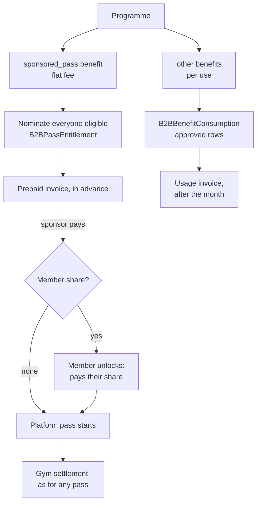

# B2B Sponsor Billing

What organisations and their beneficiaries are charged: the invoice engine. Agreements, payment terms, payments and allocation, credit and debit notes, statements and reconciliation are in [B2B_FINANCE.md](B2B_FINANCE.md) (Phase 5). It builds on [programmes and benefits](B2B_PROGRAMS.md) and the [consumption ledger](B2B_CONSUMPTION.md).

This is the **sponsor side** only. What gyms are paid is the gym settlement engine's job (`src/shared/settlement-*`, `src/services/settlement-*`), which this does not change. Trainer and vendor settlement are not built.



## 1. Decisions this implements (product owner, 2026-10-01)

| Ref | Decision |
|---|---|
| S-05 | Flat prepaid fee per covered person for gym access; per use for extras such as trainer sessions. |
| S-06 | The flat fee is the pass tier's price. A programme may carry a discount on it, set by FitFlex. |
| S-07 | The sponsor pays for everyone it nominates, whether or not each member unlocks or uses the pass. |
| S-01 | Flat fees are invoiced in advance each month. Per-use charges are invoiced on the first day of the following month. |
| S-03 | A member who owes a share pays it once, upfront, to unlock the month's pass. |
| S-02 | Amounts are VAT-inclusive. The VAT rate is stated when an invoice is issued. |
| S-04 | Corporate seats move onto this model in the same release. |

## 2. The two billing bases

| | Flat fee: `sponsored_pass` benefit | Per use: every other benefit |
|---|---|---|
| Charged for | Each covered person, each month | Each approved consumption |
| When | In advance | After the month ends |
| Sponsor pays | Its share of the fee for everyone nominated | Its share of what was used |
| Member pays | Their share once, to unlock the month | Their share of each use (recorded; see section 9) |
| Invoice kind | `prepaid` | `usage` |

A programme can hold both kinds of benefit.

## 3. The sponsored pass

A `sponsored_pass` benefit names a pass tier (`passTier`: basic, pro, premium, executive) and splits the fee with the same funding types as any benefit: fully sponsored, sponsor percentage, sponsor fixed amount, or member fixed amount. It has no usage limit or provider rule of its own; the pass tier decides visits and gyms.

**Fee per person per month** = the tier's current price (`settingsService.priceForTier`, the same price a member pays in the app) × (1 − the programme's `discountBps`). The split is then applied to that fee.

**Discount.** `B2BWellnessProgram.discountBps` (0–9999) is set by FitFlex admins only. It is copied onto each entitlement when a person is nominated, so changing it later affects new months only.

The discount is shared with gyms automatically. The settlement engine caps what gyms receive for a pass at 75% of what was **collected** for it, so a lower fee lowers that cap in step, and FitFlex keeps at least 25% of what it collects.

**The pass is an ordinary platform pass.** When it starts, the member gets a `Subscription` of type `platform_pass` on that tier, valid to the end of the EAT calendar month. Both shares are recorded as approved `PaymentRequest` rows against it:

- the sponsor's share, with provider `sponsor_invoice` and the invoice number as reference;
- the member's share, through the normal payment approval.

Together they equal the fee. Gym settlement therefore treats the pass exactly like one a member bought, with no change to the settlement engine. Check-in is unchanged too.

## 4. Lifecycle of a covered person: `B2BPassEntitlement`

One row per benefit, beneficiary and month. It snapshots the list price, discount, fee, sponsor share and member share.

| Status | Meaning |
|---|---|
| `invoiced` | Nominated and on an invoice; the sponsor has not paid yet. |
| `scheduled` | Sponsor paid; the month has not started. |
| `awaiting_link` | Sponsor paid; the person (a company employee) is not linked to a FitFlex account yet. |
| `awaiting_member` | Sponsor paid; the member must pay their share to unlock. |
| `active` | The pass is running. |
| `void` | Its invoice was voided. |

**Started once.** The pass and the sponsor's payment take their ids from the entitlement (`sub_<entitlementId>`, `pay_<entitlementId>`), and the member's request is `pay_<entitlementId>_m<attempt>`. Starting a pass again, at the same moment or after a failure half-way, finds what was written the first time: one pass, one sponsor payment, one open request.

`advanceEntitlements` moves paid-for entitlements as far as they can go. It runs when an invoice is marked paid and again daily, so an employee linked later or a month that begins later is picked up.

**Unlock.** `POST /b2b/me/passes/:entitlementId/unlock` creates the pass as `payment_pending` with a payment request for the member's share. FitFlex approves that payment the usual way. A hook on subscription activation then finishes the pass: it runs to month end and the sponsor's share is recorded. If the hook is missed, the daily job finishes it. A rejected payment leaves the pass locked and the member can ask again.

## 5. Invoices: `B2BSponsorInvoice` and `B2BSponsorInvoiceLine`

```
draft ──► issued ──► partially_paid ──► paid
   └────────┴──────► void
```

Since Phase 5 an invoice gets its number and due date on issue, is settled by payments allocated to it (in part or in full), and is corrected by credit and debit notes. See [B2B_FINANCE.md](B2B_FINANCE.md).

| Step | Who | Effect |
|---|---|---|
| Prepare | FitFlex admin, or the daily job | Adds what is not yet invoiced to the programme's open draft for that month and kind. Safe to repeat. |
| Issue | FitFlex admin | Figures freeze. The VAT rate is stated and the VAT contained in the total is stored. |
| Mark paid | A **second** FitFlex admin | Needs the sponsor's payment reference. Paying a `prepaid` invoice advances its entitlements. The person who issued the invoice gets `403 cannot_settle_own_invoice`, whoever they are; the database refuses it too (`b2b_invoice_maker_checker_ck`). |
| Void | FitFlex admin | Needs a reason. The invoice and its lines are kept; what was on it can be invoiced again. A paid invoice can't be voided. |

**Prepaid invoices** take one `pass` line per nominated person, for the sponsor's share. Nominated means: an active beneficiary who matches the programme's (and the benefit's) population rule. Someone enrolled after an invoice was issued goes on a new draft for the same month.

**Usage invoices** take one `usage` line per approved consumption with a sponsor share in the month. A consumption that was invoiced and later reversed comes back as a `credit` line (negative) the next time usage is prepared. An invoice whose total is below zero is a credit note and is issued and settled the same way.

**Database guarantees:**

- a person is covered once per benefit and month;
- an entitlement, a consumption and a credit each appear on one live invoice only;
- one open draft per programme, month and kind;
- an issued invoice's figures can't change, its status only moves forward, and paid and void are final (trigger);
- the person who issued an invoice is not the person who recorded it paid;
- rows are never deleted: a `BEFORE DELETE` trigger on consumptions, invoices, lines and entitlements refuses it. Maintenance opts in for one transaction with `SET LOCAL fitflex.allow_ledger_delete = 'on'`.

**VAT.** Amounts are VAT-inclusive whole TZS. On issue, `vatRateBps` is recorded and `vatTzs = total × rate / (10000 + rate)`, rounded. The rate must be given explicitly (0 for none), unless the organisation's commercial agreement carries one. A credit carries VAT of the opposite sign. Whether the settlement cap is taken on the VAT-inclusive or net amount is the settlement engine's open decision (DR-05), not decided here.

## 6. Corporate seats

`POST /admin/b2b/corporate/:corporateId/convert` expresses a company's seat arrangement as a **draft** programme with one sponsored pass: the company's `passTier`, and the sponsor share from its `subsidyModel` (fully funded → full; 70/30 → 7000 bps; 50/50 → 5000; employee paid → 0).

FitFlex reviews, submits and activates it like any programme. Once it is pending, active or paused with an active sponsored pass, `corporateService.generateBill` refuses with `billed_by_programme`, so the company is never charged twice. Existing `CorporateBill` rows are untouched.

Employees are nominated and invoiced even if not yet linked to a FitFlex account (`awaiting_link`). Linking them (`POST /corporate/staff/:id/link`) lets the daily job move them on.

**No month is charged twice.** Before conversion goes live a company may already hold a seat bill for a month. `preparePrepaid` refuses that month with `409 period_seat_billed` (and the bill's id and status), so the company is not invoiced for it again as a programme. Later months are invoiced normally.

## 7. API

| Method & path | Who |
|---|---|
| `POST /admin/b2b/programs/:programId/invoices/prepare` `{ kind: prepaid \| usage, period }` | FitFlex admin |
| `GET /admin/b2b/invoices?organizationId&programId&period&kind&status` | FitFlex admin |
| `GET /admin/b2b/invoices/:invoiceId` | FitFlex admin |
| `POST /admin/b2b/invoices/:invoiceId/issue` `{ vatRateBps }` | FitFlex admin |
| `POST /admin/b2b/invoices/:invoiceId/paid` `{ paymentReference }` | FitFlex admin |
| `POST /admin/b2b/invoices/:invoiceId/void` `{ reason }` | FitFlex admin |
| `GET /admin/b2b/programs/:programId/entitlements?period` | FitFlex admin |
| `POST /admin/b2b/corporate/:corporateId/convert` | FitFlex admin |
| `GET /b2b/organizations/:id/invoices` · `GET …/invoices/:invoiceId` | Organisation users with `usage.read` |
| `POST /b2b/me/passes/:entitlementId/unlock` | The member |
| `GET /b2b/me/benefits` | The member. A sponsored pass now carries `pass: { entitlementId, status, memberTzs, canUnlock, paymentPending }`. |

An organisation sees its issued, paid and voided invoices, never drafts. Pass lines are shown per person (people it nominated). Usage is shown as totals per benefit and person, never the date or place of a visit.

## 8. Daily job

`b2bSponsorBilling`, 00:20 EAT:

1. Starts passes that can start, and finishes any unlock whose payment was approved.
2. For each active programme, keeps drafts current: flat fees for this month, flat fees for next month from the 25th, and last month's per-use charges.

It only creates drafts. FitFlex issues and settles them.

## 9. Known limitations

- **Per-use benefits are fully sponsored** (decided 3 Oct 2026). A member pays their share before using a benefit, and only the sponsored pass can collect it, so a sponsor/member split is offered as a sponsored pass. See [B2B_PROGRAMS.md](B2B_PROGRAMS.md).
- **Trainer sessions.** The member pays the booking in full when they book. When the session is completed and a sponsor covers it, the sponsor is charged on the usage invoice and the member is refunded what they paid, through the refunds queue (`b2b-sponsor-refund-service`, reason `sponsor_paid`). Staff pay refunds by hand, so the member waits for that.
- **Sponsor paid, member never unlocks.** The sponsor's share stays with FitFlex (S-07). No pass exists, so gyms are owed nothing for that person.
- **Budget.** A programme's `budgetTzs` pauses per-use consumption only. Flat fees are not checked against it.
- **Mid-month changes.** A member suspended or removed mid-month keeps the pass to month end; they are not nominated the following month.
- **Two price lists.** The fee uses the app's pass prices (`settingsService`). The settlement engine's `PassTierVersion` prices are separate; aligning them is the settlement spec's open DR-22.
- **Trainer and vendor settlement** are not built.
