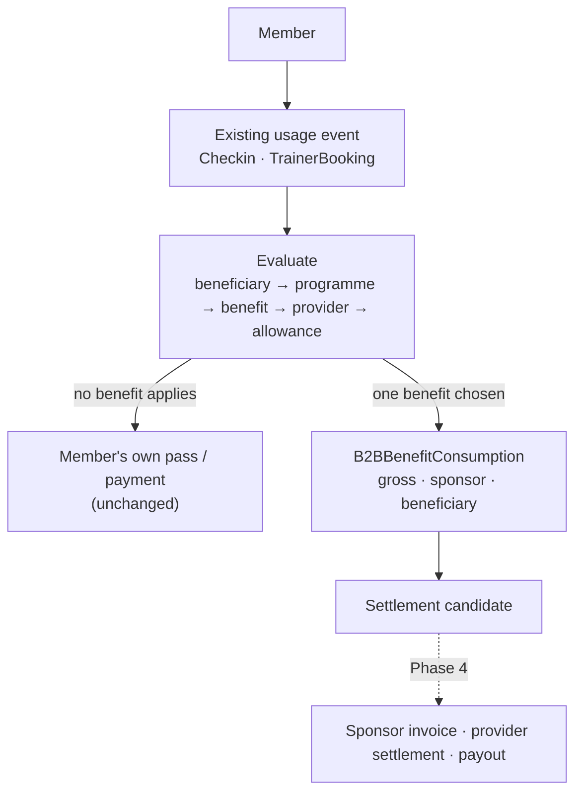

# B2B Phase 3: Benefit Consumption and Usage

Phase 3 connects the benefits defined in [Phase 2](B2B_PROGRAMS.md) to real use of FitFlex services, on top of the [Phase 1 foundation](B2B_FOUNDATION.md).

It decides whether a benefit covers a usage event, records which benefit covered it, and records what the sponsor and the beneficiary each owe. It does **not** compute what a gym or trainer is paid. That is Phase 4.



## 1. Three separate things

| Thing | Question | Where it lives |
|---|---|---|
| Benefit | What is the beneficiary entitled to? | `B2BBenefit` (Phase 2) |
| Usage event | What did the member actually do? | The **existing** row: `Checkin`, `TrainerBooking`. Not copied. |
| Consumption | Which benefit covered that usage, and who owes what? | `B2BBenefitConsumption` (new) |

A usage event doesn't automatically consume a benefit. It is evaluated first, and it is always the server that evaluates. No caller can name a benefit, an amount, a usage count or a remaining allowance, and **no route consumes a benefit**. Usage only enters through the gym check-in and trainer booking services.

## 2. The ledger: `B2BBenefitConsumption`

Migration `20261103090000-b2b-benefit-consumption`.

| Group | Columns |
|---|---|
| Who and what | `organizationId`, `programId`, `benefitId` (foreign keys, `RESTRICT`), `beneficiaryId` + `beneficiarySource` (a `B2BBeneficiary` or a `CorporateEmployee`), `userId` |
| Source event | `sourceType` (`gym_checkin`, `trainer_booking`), `sourceId` (the check-in or booking ID) |
| Service | `serviceType` (the benefit type), `providerType` (`gym`, `trainer`), `providerId` |
| When | `consumedAt`, `businessDate` (the EAT day that usage windows count on), `verifiedAt` |
| Money, whole TZS | `quantity`, `unitValueTzs`, `grossTzs`, `sponsorTzs`, `beneficiaryTzs`. The database enforces `sponsorTzs + beneficiaryTzs = grossTzs`. |
| Outcome | `status`, `rejectionReason`, `reversedAt`, `reversedBy`, `reversalReason` |
| Audit | `rulesSnapshot` (the funding and limit rules in force, the window, usage before, what was left after, and the other benefits that could have applied), `metadata`, `initiatedBy` |

Indexes: `(benefitId, beneficiaryId, businessDate)` for allowance counting, `(organizationId, consumedAt)`, `(programId, status)`, `(providerType, providerId)`, `userId`, and `(sourceType, sourceId)`.

**The ledger is the source of truth for allowances.** Remaining usage is always counted from it. There is no mutable counter.

### Status

```
pending ──► approved ──► reversed
   └──────► cancelled            rejected  (recorded once, never changes)
```

| Status | Meaning |
|---|---|
| `pending` | The allowance is reserved while the usage event is being recorded. |
| `approved` | The usage happened and is verified (`verifiedAt`). Only these rows are settleable. |
| `rejected` | A beneficiary's benefit was refused for an allowance reason: `usage_limit_reached`, `period_sponsor_cap_reached` or `program_budget_exhausted`. It covers nothing (`sponsorTzs = 0`). |
| `reversed` | An approved row undone by FitFlex, with who, when and why. It stops counting, so the allowance and the programme budget get it back. |
| `cancelled` | A reservation whose usage event was never recorded. |

Rows are never deleted. A database trigger makes the recorded money, source and identity immutable and allows only the status moves above.

"Not eligible at all" outcomes (not a beneficiary, programme paused, gym not covered) aren't written to the ledger. They would flood it with every ordinary check-in. Use the dry run (section 9) to see them.

## 3. Evaluation

`b2bConsumptionService.evaluate` is a dry run and `consume` writes. Both apply the same checks in the same order, and the first failure is the reason:

1. The user has a beneficiary relationship (a native one, or a company employee linked to their account) in an **active** organisation.
2. The beneficiary is active.
3. The programme is effectively active, and the day is within its dates.
4. A benefit of the right type exists, is active, and the day is within its validity.
5. The beneficiary matches the programme's population rule and the benefit's narrowing.
6. The provider matches the benefit's provider rule. A gym qualifies if it is listed by ID **or** its tier is listed.
7. Allowance: the usage limit in the current window, then the per-period sponsor money cap.
8. Programme budget.
9. Coverage: `calculateResponsibility` splits the price.

Reading the candidates takes two queries however many organisations a member belongs to. Allowance counting reads only the current window.

### Usage windows

Periods are **calendar** periods in East Africa Time: a day, Monday–Sunday, a calendar month, a calendar quarter, or the whole benefit validity. They are not rolling "30 days from enrolment" periods. Phase 2 has no rolling option, so none is implemented.

### Funding

Integer TZS and basis points, with no floating-point money.

| Case | Price 5,000 → sponsor / member |
|---|---|
| Full sponsorship | 5,000 / 0 |
| Fixed sponsor amount 3,000 | 3,000 / 2,000 |
| Percentage 60% | 3,000 / 2,000 |
| Percentage 60% with a per-use cap of 2,500 | 2,500 / 2,500 |
| Benefit covers up to 4,000 | 4,000 / 1,000 |
| Copay 2,000 | 3,000 / 2,000 |
| Per-period sponsor cap partly used | not covered unless what is left of the cap pays the whole use |

Only full sponsorship applies to a use (decided 3 Oct 2026): a member can't pay a share at the door, so a split is offered as a sponsored pass. The split rows above are how `calculateResponsibility` divides a sponsored pass's fee, and how a split benefit created before the rule is recognised and refused (`member_share_not_collectable`).

## 4. One sponsor per usage (decided 2026-10-01)

| Rule | Behaviour |
|---|---|
| Order | A sponsor's benefit is tried first, then the member's own pass. |
| No stacking | Exactly one benefit covers a usage event. The unique index on the source makes two impossible. |
| Tie-break | Among benefits that could cover it: the one that leaves the member paying least; if equal, an employer's; then the older programme; then the benefit ID. |
| Next in line | If the chosen benefit turns out to be exhausted, the next candidate is tried. |
| Fallback | When no benefit covers it, the member's own pass is validated exactly as before. |
| Budget | When a use would take a programme past `budgetTzs`, the use is refused and the programme is **paused** with `statusReason = budget_exhausted`. Only a FitFlex admin can resume it, with a mandatory remark, and only once there is budget to spend (raise the budget first if it is fully spent). |

## 5. Idempotency and concurrency

- **Idempotency key:** the source event, `(sourceType, sourceId)`, for example the check-in ID. A unique index on it for live rows (`pending`, `approved`) means a usage event consumes at most once, however often or however concurrently it is submitted. It's not a random ID.
- **Concurrency:** each consumption runs in one database transaction that takes `SELECT … FOR UPDATE` on the programme row and the benefit row, re-reads usage from the ledger, then inserts. Two simultaneous requests for the last allowance are serialised: one is approved and the other is refused. The same lock protects the programme budget.
- **One visit per member, gym and day:** a unique index on `Checkin (memberId, gymId, businessDate)` for live visits (`checkin_one_visit_per_day_uq`). Two scans a few milliseconds apart used to record two visits and charge the sponsor twice. Now the database refuses the second; its hold is cancelled (`duplicate_scan`) and the first visit is returned.
- **Ledger and audit together:** every change of a ledger row and its `AuditLog` entry are written in one transaction.

## 6. Integration points

| Service | Usage event | Verified when | Status |
|---|---|---|---|
| **Gym** | `Checkin` | the check-in row is written | **Implemented** |
| **Trainer** | `TrainerBooking` | the booking becomes `completed` | **Implemented** |
| Marketplace | `ShopOrder` | order paid and delivered | Deferred |
| Challenge | joining a challenge | n/a | Deferred |

### Gym check-in

Both QR directions (staff scans the member, or the member scans the gym) go through `checkInService.perform`. The benefit path sits **in front of** the existing validation:

1. The existing "already checked in here today" rule returns the same visit. Nothing more is consumed.
2. If a benefit covers this gym and the gym is open: reserve the allowance (`pending`), write the `Checkin` with `subscriptionType = 'b2b_benefit'`, `visitConsumed = false` and `subscriptionId = null`, then confirm (`approved`). If writing the check-in fails, the reservation is cancelled. If the confirmation fails the member is still let in, because the visit is recorded.
3. Otherwise the existing personal validation runs unchanged. Any error while evaluating a benefit also falls through to it, so a B2B problem can never block a member who could check in before.

Other details:

- **Value:** the gross value is the gym's retail day rate (`ratePerDay`, else `perVisitRate`). A free gym (value 0) never uses an allowance.
- **Personal pass untouched:** a benefit-funded visit doesn't use a visit from the member's own pass.
- **Benefit-only members:** a member whose only gym access is a benefit can now get their QR code. The staff "verify" preview shows `reason: sponsor_benefit` and consumes nothing.
- **Privacy at the gym:** gym staff see `b2b: { covered: true }` only. The member's own scan returns the sponsor, the split and what's left.
- **Voiding:** voiding a check-in (`checkinStatusService`) reverses its consumption.
- **Holds left behind:** the three steps are separate writes, so a check-in interrupted half-way can leave a `pending` hold. The `b2bHoldReconciler` job runs every 5 minutes: a hold older than two minutes is approved when its visit exists and cancelled when it doesn't (`reconcileHolds`). No allowance stays blocked, and no recorded visit goes uncharged or unpaid.
- **Gym dashboards:** `b2b_benefit` visits count as FitFlex visits.

### Trainer sessions

A booking that is only created or paid consumes nothing. When it becomes `completed` (by the trainer or by an admin), a `trainer_session` benefit that covers that trainer is consumed. The gross value is the booking's `amountTzs`, and the provider is the `TrainerProfile` ID. If an admin later moves a completed booking to another status, the consumption is reversed.

The member has already paid the booking in full when it was confirmed (`metadata.memberPaidTzs`). The ledger records what the sponsor owes.

**No double charge.** The member pays a booking in full when they book it; nobody knows yet whether a benefit will cover it. When the completed session is consumed on a benefit, the sponsor is charged and a refund is raised to the member for the same money, up to what they paid (`Refund`, kind `trainer_booking`, reason `sponsor_paid`, approved by policy). FitFlex staff pay it from **Admin → Refunds**.

- One live refund per booking: a session cancelled after it was covered uses the refund already raised, not a second one.
- If the session is un-completed without being cancelled, the sponsor's charge is reversed and a refund not yet paid is withdrawn. One already paid is left alone and logged.
- The daily B2B job raises any refund a covered session of the last 7 days is missing.

### Deferred

- **Marketplace:** applying a sponsor share changes what the member is charged at checkout. That needs the payment-collection work in Phase 4. Integration point: `shop-service` order creation and payment approval.
- **Challenges:** access to a challenge is eligibility, not a money transaction, so there's nothing to record as financial consumption. Sponsored rewards are already modelled by challenge rewards (`funder`). Integration point: challenge eligibility could read `providerRules.challengeIds`.

Hooks into existing services (`onVoided`, `onStatusChanged`) run after the original action has succeeded, and their errors are logged and swallowed.

## 7. Corporate

A company mapped in Phase 1 uses this engine like any organisation. Its employees are beneficiaries, read through from `CorporateEmployee`.

An employee can only use a benefit once they're linked to their FitFlex member account. `POST /corporate/staff/:id/link` (HR, or an admin) writes `CorporateEmployee.userId`; sending `userId: null` unlinks. Until now nothing wrote that column.

Not done here: converting Corporate seat billing into a programme with a "sponsored pass" benefit (decision C). It needs sponsor invoicing, so it belongs to Phase 4. Until then, don't give a seat-billed company a gym-access programme, or the same visits would be funded twice.

## 8. Permissions and privacy

| Who | Sees |
|---|---|
| FitFlex admin (`b2b` scope) | The whole ledger: every row, its source event, the rules snapshot and the settlement candidate. Can reverse. Reversing a gym visit also needs the `payments` scope, because it voids the visit. |
| Organisation users with `usage.read` (owner, admin, manager, finance, analyst) | Their own programmes' **aggregates**: totals, budget, and breakdowns by benefit, provider and beneficiary (uses and amounts). |
| Member | Their own benefits with used and remaining (`GET /b2b/me/benefits`). |
| Gym staff | That a sponsor covers the visit, nothing else. |

Organisation users don't see individual events: not where or when a particular person visited. This follows the Identity decision that an employer sees participation, while activity and check-ins need consent.

A programme of another organisation is a 404, as in Phases 1 and 2.

## 9. API

| Method & path | Who |
|---|---|
| `GET /admin/b2b/consumptions?organizationId&programId&benefitId&beneficiaryId&userId&providerType&providerId&serviceType&sourceType&sourceId&status&from&to` | FitFlex admin |
| `GET /admin/b2b/consumptions/:consumptionId` | FitFlex admin |
| `POST /admin/b2b/consumptions/:consumptionId/reverse` `{ reason }` | FitFlex admin. For a gym visit this voids the check-in too and returns `checkinVoided: true`; portal staff without `payments` get `403 acl_forbidden`. |
| `POST /admin/b2b/evaluate-usage` `{ userId, serviceType, providerId }` | FitFlex admin. A dry run that writes nothing; the value comes from the gym or trainer record. |
| `GET /b2b/organizations/:id/programs/:programId/usage?from&to` | `usage.read` |
| `GET /b2b/me/benefits` | Member. Now includes `used`, `remaining`, `sponsorUsedTzs`, `sponsorRemainingTzs`. |
| `POST /corporate/staff/:id/link` `{ userId }` | Corporate HR, or an admin |

Every consumption, reversal and budget pause is written to `AuditLog` (`b2b.consumption.hold`, `.approve`, `.cancel`, `.reverse`, and `b2b.program.paused`).

## 10. Phase 4 handoff: the settlement candidate

> Since this was written: sponsor-funded gym visits are settled to gyms by the settlement engine, and what sponsors and members are charged is in [B2B_BILLING.md](B2B_BILLING.md).

Phase 3 hands Phase 4 one thing: approved ledger rows. `settlementCandidate(row)` in `src/shared/b2b-programs.mjs` is the shape (admin detail returns it):

```
consumptionId, organizationId, programId, benefitId, beneficiaryId, userId,
providerType, providerId, serviceType, sourceType, sourceId,
consumedAt, businessDate, quantity,
grossTzs, sponsorTzs, beneficiaryTzs, currency,
status, verifiedAt, settleable   (settleable = status is approved)
```

Phase 4 will use these to decide:

- **Sponsor invoicing:** the sum of `sponsorTzs` per organisation and period. `CorporateBill` is the existing pattern.
- **Beneficiary collection:** per-use benefits are fully sponsored, so there is no member share to collect. For trainer sessions the member already paid in full, so what the sponsor covers is refunded to them (see Trainer sessions).
- **Provider settlement and payout:** from verified usage, the provider's rate card and agreement, and the funding source, through the settlement engine (`src/shared/settlement-*`).
  - **Gym visits are settled (decided 1 Oct 2026).** `settlement-service` settles approved `gym_checkin` consumptions with the same visit brackets and network cap as a member's own pass: one cycle per beneficiary per EAT month, capped at the network % of the month's `grossTzs` for that beneficiary's gym visits. Each company-funded visit counts on its own, so two gyms on one day both count. A month is settled once its end + 24 h + the 7-day dispute window has passed. Reversed, cancelled and pending rows are left out; a disputed or flagged check-in holds the whole month.
  - The cap is computed on what was **charged** (`grossTzs`), which isn't yet collected: sponsor invoicing is still to do.
  - Trainer sessions are not settled by that engine.
- **A reversal after settlement:** a gym visit is undone as a whole. Reversing its consumption voids the check-in, and the void raises the gym's clawback on its next statement (`settlement-clawback-service`). A sponsor is never credited for a visit the gym keeps being paid for.

The consumption ledger itself still stores no provider payout: the gym's amount lives in the settlement tables (`MemberCycleSettlement` with `fundingType = 'b2b_benefit'`, `GymSettlementLine`, `SettlementVisit`).

## 11. Known limitations

- A per-use benefit never leaves the member a share: it is fully sponsored (decided 3 Oct 2026). A split benefit created before that no longer covers a use (`member_share_not_collectable`, kept on the ledger as a rejection); the member's own pass applies instead. A per-period sponsor cap covers whole uses only.
- A benefit applies before the member's own pass even when the pass would have made the visit free for them and the benefit has a copay. That is the decided order.
- The legacy admin finance summaries (`finance-service`) count every check-in at a gym's rate, including `b2b_benefit` ones. They are dashboards, not the settlement engine.
- A gym owner's suspension of a direct member doesn't stop that member checking in on a sponsor's benefit.
- No rolling usage periods, no benefit priority field, and no stacking.
