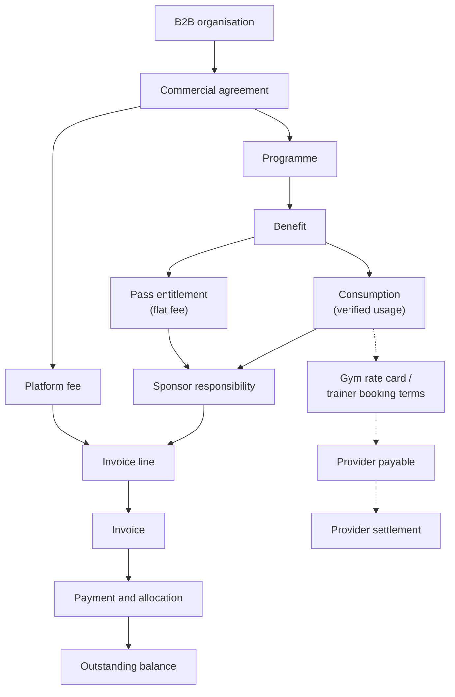

# B2B Billing and Financial Management (Phase 5)

What FitFlex charges an organisation, what the organisation has paid, and what it still owes. It builds on the invoice engine in [B2B_BILLING.md](B2B_BILLING.md), the [consumption ledger](B2B_CONSUMPTION.md) and [programmes and benefits](B2B_PROGRAMS.md).

## 1. Two separate processes



**B2B customer billing is not provider settlement.**

| | Customer billing (this document) | Provider settlement |
|---|---|---|
| Question | What does the organisation owe FitFlex? | What does FitFlex owe the gym or trainer? |
| Governed by | The commercial agreement, the programme and its benefits | Gym rate cards and settlement rules; trainer booking terms |
| Source | Sponsor responsibility on the consumption ledger; pass entitlements; the platform fee | Visit brackets and the network cap; the booking's payout |
| Tables | `B2BCommercialAgreement`, `B2BSponsorInvoice`, `B2BPayment`, … | `GymSettlement`, `TrainerSettlement`, … |
| Code | `b2b-billing-service`, `b2b-finance-service` | `settlement-*`, `trainer-settlement-service` |

Nothing in billing reads a settlement to work out a charge, and nothing in billing pays a provider. The settlement tables are only read, in two places, to show the two side by side (sections 9 and 10).

The names in the Phase 5 brief map onto the repository like this:

| Brief | Repository |
|---|---|
| `B2BCommercialAgreement` | `B2BCommercialAgreement` (new) |
| `B2BBillingAccount` | `B2BBillingAccount` (new), falling back to `CorporateAccount.billingContact*` and the organisation's own contact |
| `B2BInvoice`, `B2BInvoiceLine` | `B2BSponsorInvoice`, `B2BSponsorInvoiceLine` (existing, generalised; no second invoice engine) |
| `B2BPayment`, `B2BPaymentAllocation` | Same names (new) |
| `B2BBillingAdjustment` | A credit or debit note: an invoice of kind `credit_note` / `debit_note` |
| `ProviderAgreement`, `ProviderPayableEntry`, `ProviderSettlement` | `GymRateCard` + `SettlementRule`, `GymSettlementLine`, `GymSettlement`; `TrainerSettlementLine`, `TrainerSettlement` |

## 2. Decisions this implements (product owner, 4 Oct 2026)

| Ref | Decision |
|---|---|
| P5-01 | A fixed monthly platform fee, optional per organisation, on its agreement. |
| P5-02 | Sponsored passes start only when their invoice is paid in full. A member's own share is unchanged: full share, pass to the end of the calendar month, no pro-rating. |
| P5-03 | A payment bigger than what is owed stays on the organisation's account as credit. |
| P5-04 | Default terms: invoices raised in advance are due on issue; invoices raised after the month are due in 14 days. Set per organisation on its agreement. |
| P5-05 | In an organisation, the owner, admin and finance roles see billing (`billing.read`). |
| P5-06 | Three staff grants: `b2b_billing`, `b2b_billing_approve`, `b2b_payments`. |
| P5-07 | Corporate seat bills appear on the statement, read only. |
| P5-08 | Document numbers are sequential and given on issue. |

Earlier decisions still hold: amounts are VAT-inclusive with the rate stated at issue (S-02); per-use benefits are fully sponsored and a split is offered only as a sponsored pass (3 Oct 2026).

## 3. Commercial models

One architecture carries all three models, for every organisation type (employer, insurer, club, bank).

| Model | How it is represented |
|---|---|
| **A. Sponsored access** | A fully sponsored benefit: per use (`gym_access`, `trainer_session`) invoiced after the month, or a fully sponsored pass invoiced in advance. |
| **B. Subsidised access** | A sponsored pass with a sponsor/member split. The sponsor is invoiced its share; the member pays theirs to unlock. Per-use benefits can't be split. |
| **C. Programme / platform fee** | `platformFeeTzs` on the agreement: one `fee` invoice a month, alongside any pass and usage invoices. |

Billing models in use: per beneficiary (the pass), usage-based (per-use benefits), a fixed monthly fee, and any mix of them. A programme's `discountBps` gives contracted pass pricing. The cycle is monthly; other cycles are refused (`unsupported_billing_cycle`) until there is a need.

## 4. Commercial agreement: `B2BCommercialAgreement`

How FitFlex charges one organisation. It doesn't say what providers are paid.

| Field | Meaning |
|---|---|
| `reference` | FitFlex's number, `FF-AGR-YYYY-NNNNNN` |
| `contractReference` | The signed contract's own number, if any |
| `effectiveFrom`, `effectiveTo` | EAT days; `effectiveTo` null = open-ended |
| `prepaidTermsDays` | Days to pay an invoice raised in advance (pass, fee). Default 0. |
| `usageTermsDays` | Days to pay an invoice raised after the month (usage, debit note). Default 14. |
| `platformFeeTzs` | Monthly fee, VAT-inclusive; null = none |
| `vatRateBps` | Offered when an invoice is issued; null = stated each time |
| `billingCycle`, `currency` | `monthly`, `TZS` |

```
draft ──► active ──► ended
```

- A draft is edited freely. One in force is not edited (service and trigger): it is ended, and a new one is activated.
- Activating an agreement that starts later closes the open one the day before, so exactly one applies to any day. Dates overlapping an agreement already ended are refused (`agreement_dates_overlap`): history is not rewritten.
- An organisation with no agreement is billed on the default terms, with no fee.

**Snapshot.** When an invoice is issued, the terms in force that day are stored on it (`terms`, `agreementId`), with its due date. A pass line carries the list price, discount and split it was nominated at (`B2BPassEntitlement`), and a usage line the sponsor share recorded at the time of use. A later agreement or price never changes an issued invoice.

## 5. Billing account: `B2BBillingAccount`

Who the invoices go to: contact name, email, phone, address. One per organisation. Until one is set, a company moved over from Corporate uses `CorporateAccount.billingContact*`, and any other organisation its own email and phone. TIN and registration number stay on `B2BOrganization`.

## 6. Invoices

The existing `B2BSponsorInvoice`, with what Phase 5 adds.

| `kind` | What | Raised | Due |
|---|---|---|---|
| `prepaid` | Sponsor share of sponsored passes, one line per person | In advance | Advance terms |
| `fee` | The platform fee, one line; no programme | In advance | Advance terms |
| `usage` | Sponsor share of approved per-use consumption, one line per use | After the month | Usage terms |
| `debit_note` | An amount added to an issued invoice | When needed | Usage terms |
| `credit_note` | An amount taken off an issued invoice (negative total) | When needed | None |

```
draft ──► issued ──► partially_paid ──► paid
   │         │  ◄──────────┘ (payment reversed)
   └─────────┴──► void   (only while nothing is allocated to it)
```

`overdue` is not a status: an open invoice is overdue from the day after its `dueDate`.

**On issue** (one transaction, the row locked):

- the number is assigned from a gap-free counter: `FF-INV-`, `FF-CN-` or `FF-DN-` + year + six digits. A draft carries a `DRAFT-…` working reference. Invoices issued before Phase 5 keep their `SI-…` numbers;
- VAT is worked out on the frozen total, at the rate given or the agreement's;
- the due date is the issue day plus the terms;
- the terms are stored on the invoice.

**Generation is idempotent.** Each generator adds only what is not yet invoiced, under a lock, and the database enforces it: one open draft per programme, month and kind; a consumption, an entitlement and a credit each on one live invoice; one fee invoice per organisation and month. The daily job (`b2bSponsorBilling`, 00:20 EAT) drafts pass and fee invoices for this month (and next, from the 25th) and last month's usage. It only drafts: FitFlex issues.

**Usage billing** reads the consumption ledger, never check-ins:

```
gym check-in / completed session → B2BBenefitConsumption (approved) → sponsorTzs → usage line → invoice
```

Pending, rejected, cancelled and reversed rows are not billed. A row reversed after it was invoiced comes back as a credit line on the next run.

## 7. Payments and allocation

`B2BPayment` is money received: amount, method (`bank_transfer`, `mobile_money`, `lipa_namba`, `cheque`, `cash`, `card`, `other`), the bank or mobile-money reference, when it was received, and a receipt number `FF-RCT-YYYY-NNNNNN`. There is no payment gateway yet: payments are recorded by FitFlex staff. A gateway would create the same rows.

`B2BPaymentAllocation` says which invoice a payment settles, and for how much.

| Rule | How |
|---|---|
| The same reference is one payment | Unique on organisation, method and reference (case-insensitive). Recording it again returns the first; a different amount is `409 payment_reference_in_use`. |
| One payment, several invoices | `allocations: [{ invoiceId, amountTzs }]`, or `autoAllocate` (oldest due first). |
| Part payment | The invoice becomes `partially_paid`; `amountPaidTzs` and what is outstanding follow. |
| Overpayment | What isn't allocated stays on the payment and shows as credit on the account; it is allocated later. |
| Never twice | An allocation is checked against what is left on the payment **and** on the invoice, with both rows locked. A repeat finds nothing left to allocate; an optional `requestId` returns the first result. |
| Maker-checker | The person who issued an invoice cannot record or allocate its payment (`403 cannot_settle_own_invoice`); the database refuses `paidBy = issuedBy`. |
| Passes | A prepaid invoice starts its passes only when it is paid in full. |
| Reversal | A payment that didn't arrive is reversed with a reason; what it part-settled opens again. A payment that **completed** an invoice is not reversed, because a paid invoice is final: a debit note records what is owed. |

`POST /admin/b2b/invoices/:id/paid` still works: it records a payment for what is owed and allocates it.

## 8. Credit and debit notes

An issued invoice is never edited. A correction is a note raised on it:

- drafted by one person (`b2b_billing`) with a reason, issued by another (`b2b_billing_approve`); the database refuses `issuedBy = createdBy`;
- a **credit note** can't exceed the invoice less the credits already raised on it. On issue it is applied to the invoice it corrects, up to what is owed; the rest stays as credit and is applied to other invoices of the same organisation (`POST /admin/b2b/notes/:id/apply`);
- a **debit note** is a new amount owed, with its own due date;
- VAT follows the sign of the total: a credit note reverses VAT.

Usage reversed after invoicing still comes back as an automatic credit (a `usage` invoice with a negative total); it is applied the same way.

## 9. Statement, aging and balances

`statement` lists, in date order with a running balance: invoices, debit notes, credit notes, payments, payment reversals, and (for a company moved over from Corporate) its seat bills and their payments. `from` / `to` give a date range; what came before is the opening balance.

| Figure | Meaning |
|---|---|
| `outstandingTzs` | Owed on open invoices, plus unpaid seat bills |
| `overdueTzs` | The part past its due date |
| `creditTzs` | Unallocated payments plus unapplied credit notes |
| `balanceTzs` | Outstanding less credit |
| `aging` | Outstanding by days overdue: `current`, `days1to30`, `days31to60`, `days61to90`, `over90` |

Seat bills have no due date and are counted as current.

The finance dashboard (`GET /admin/b2b/billing`) gives the same per organisation and in total, the month's drafts, and for a month what was **billed** next to what **providers are owed** for the same activity: gym settlement of sponsor-funded visits, gym settlement of sponsored passes, and trainer settlement of covered sessions. The difference is shown as a number, with a note that it is **not revenue or profit**: it ignores members' own shares, VAT, unpaid invoices and months not yet settled.

## 10. Reconciliation

`GET /admin/b2b/invoices/:id/reconciliation` traces one invoice:

```
invoice → line → consumption → check-in or booking            (usage)
invoice → line → pass entitlement → the member's pass         (flat fee)
invoice → allocations → payments and credit notes → balance
```

and, beside each line, where the provider side of the same activity stands: the settlement visit and gym statement for a check-in, or the pass's settled cycle. It also checks that the lines add up to the total, that each usage line equals the sponsor share on the ledger, and lists any usage reversed since it was invoiced.

The other direction is the settlement engines' own trail (statement → line → visit → check-in). The two meet at the check-in or the booking, and nowhere else.

## 11. Permissions

**Organisation users** (`/b2b/organizations/:id/…`): `billing.read`, held by `owner`, `admin` and `finance`. HR, managers, analysts and viewers get `403`. Another organisation's id, or its invoice named under one's own, is `404`. Drafts are hidden. What an organisation is shown names no FitFlex staff member and no internal note.

**FitFlex portal staff:**

| Grant | Allows |
|---|---|
| any of `b2b`, `b2b_billing`, `b2b_billing_approve`, `b2b_payments` | Read invoices, payments, statements, the dashboard |
| `b2b_billing` | Agreements, billing account, prepare, issue, void, draft a note |
| `b2b_billing_approve` | Issue a note, reverse a payment |
| `b2b_payments` | Record and allocate payments, apply a credit |

Super admins hold all of them, but the second-person rules (issue → pay, draft note → issue note) apply to everyone.

Every amount is worked out on the server. A request can't set a total, an amount paid or a balance.

## 12. API

FitFlex staff:

| Method & path | Grant |
|---|---|
| `GET /admin/b2b/billing?period` | read |
| `GET` · `POST /admin/b2b/organizations/:id/agreements` | read · `b2b_billing` |
| `PATCH /admin/b2b/agreements/:id` · `POST …/activate` · `POST …/end` | `b2b_billing` |
| `GET` · `PUT /admin/b2b/organizations/:id/billing-account` | read · `b2b_billing` |
| `POST /admin/b2b/programs/:id/invoices/prepare` · `POST /admin/b2b/organizations/:id/invoices/prepare-fee` | `b2b_billing` |
| `POST /admin/b2b/invoices/:id/issue` · `…/void` | `b2b_billing` |
| `POST /admin/b2b/invoices/:id/paid` | `b2b_payments` |
| `POST /admin/b2b/invoices/:id/notes` | `b2b_billing` |
| `POST /admin/b2b/notes/:id/issue` | `b2b_billing_approve` |
| `POST /admin/b2b/notes/:id/apply` | `b2b_payments` |
| `GET /admin/b2b/invoices` · `…/:id` · `…/:id/reconciliation` | read |
| `POST /admin/b2b/organizations/:id/payments` | `b2b_payments` |
| `POST /admin/b2b/payments/:id/allocate` | `b2b_payments` |
| `POST /admin/b2b/payments/:id/reverse` | `b2b_billing_approve` |
| `GET /admin/b2b/payments` · `…/:id` | read |
| `GET /admin/b2b/organizations/:id/statement?from&to` | read |

Organisation (`billing.read`): `GET /b2b/organizations/:id/billing`, `…/invoices`, `…/invoices/:invoiceId`, `…/payments`, `…/statement`.

## 13. Corporate compatibility

`CorporateBill`, its routes and its figures are untouched. A company keeps its seat bills until its seats are converted into a programme ([B2B_BILLING.md](B2B_BILLING.md) §6); a month already seat-billed is not invoiced again. Seat bills are shown on the organisation's statement and counted in what it owes, read only: they are still created and marked paid through the Corporate routes.

## 14. Audit and integrity

- Every step writes `AuditLog`: `b2b.agreement.*`, `b2b.billing_account.update`, `b2b.invoice.prepare|issue|paid|void`, `b2b.payment.record|allocate|reverse`, `b2b.credit_note.create`, `b2b.debit_note.create`. Payments, allocations, agreements and notes write theirs in the same transaction as the change.
- Money is whole TZS in integer columns; percentages are basis points. There is no floating-point money.
- Invoices, lines, entitlements, payments and allocations can't be deleted (trigger). Totals, number, due date and terms of an issued invoice can't change (trigger).
- Book-keeping (`GET /admin/book-keeping`) counts money received from organisations as income once: the payment, not the mirror row that carries the sponsor's share onto a member's pass.

## 15. Known limitations

- **No payment gateway.** Payments are recorded by hand. Selcom, bank and mobile-money integration are not built.
- **No PDF.** The portal has a print view of an invoice and of the statement.
- **Tax.** VAT-inclusive amounts with a stated rate only. No withholding tax, no EFD/TRA receipt, no tax-exclusive pricing. The rate and the document numbering format are for the accountant to confirm.
- **Monthly only.** Weekly or contract-specific billing periods are not built.
- **A payment that settled an invoice can't be reversed**; a debit note is raised instead.
- **A credit note doesn't stop a pass.** Crediting a person's fee on a prepaid invoice doesn't end their pass.
- **Seat bills** have no due date, so they never age.
- **Programme budgets** still cover per-use benefits only.
- **Provider side shown, not netted.** The dashboard compares billed amounts with settled provider obligations; it is not an income statement.
- **Vendor settlement** is not built.
