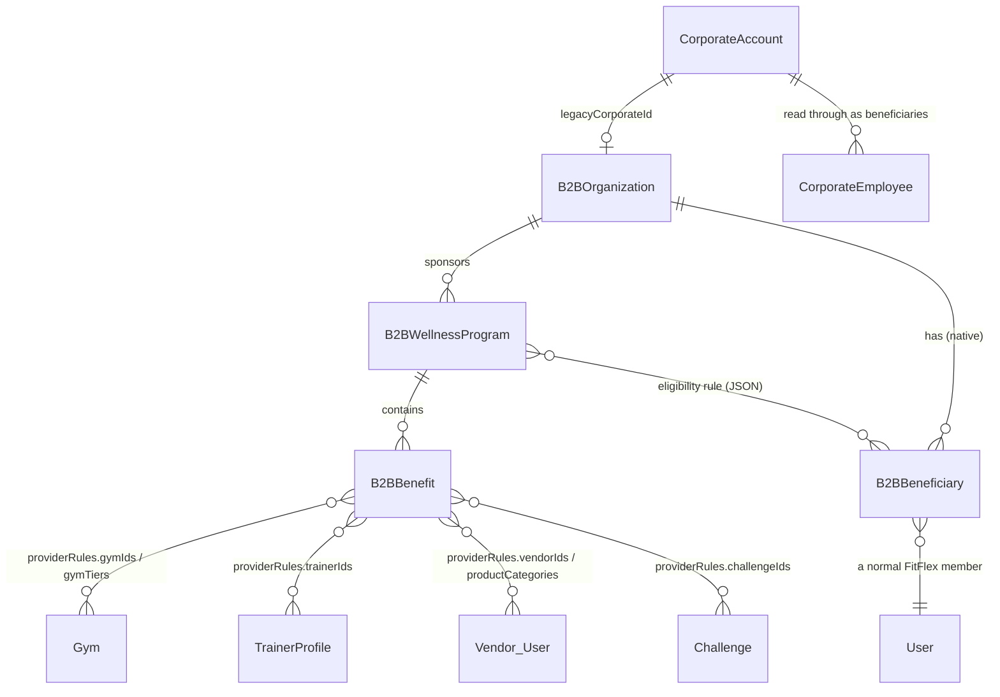

# B2B Phase 2: Wellness Programmes and Benefits

Phase 2 builds on [B2B Foundation V1](B2B_FOUNDATION.md) (organisations, organisation users, beneficiaries):

> Organisation → **Wellness Programme** → **Benefits** → Eligible Beneficiaries → FitFlex services

It defines **rules only**: who is eligible, what the sponsor and the beneficiary each pay, how often a benefit can be used, when it's valid, and which existing FitFlex providers can fulfil it. Nothing here counts usage, bills anyone or pays providers. Those belong to Phase 3 (consumption) and Phase 4 (settlement).

## 1. Existing capabilities → benefit types

No capability is duplicated. Each benefit type points at the service that will fulfil it in Phase 3:

| Existing FitFlex capability | Benefit type | Provider rules it can use |
|---|---|---|
| Gym check-in (`Checkin`, pass tiers, gym tiers) | `gym_access` | `gymIds`, `gymTiers` |
| Trainer booking (`TrainerBooking`, `TrainerProfile.id`) | `trainer_session` | `trainerIds` |
| Challenges and challenge rewards (`Challenge`, `ChallengeReward` with `funder`) | `challenge` | `challengeIds`: FitFlex challenges, or the mapped company's own |
| Marketplace (`Product.category`, vendor `User`, `ShopOrder`) | `marketplace` | `vendorIds`, `productCategories` |
| No events or workshops in FitFlex yet | `wellness_activity` | none; described in `terms` |
| Anything else | `custom` | none |

Types, labels and the capability map live in `src/shared/b2b-programs.mjs` (`BENEFIT_TYPES`), and `GET /b2b/programs/reference` serves them. The database only checks a type's shape (a lowercase slug), so adding a type needs no migration.

## 2. Programme (`B2BWellnessProgram`)

| Field | Notes |
|---|---|
| `organizationId` | FK to `B2BOrganization`, cascading. |
| `name`, `description`, `programType` | Types: wellness, fitness, employee_wellness, member_wellness, insurance_wellness, campaign, other. These are labels only; the organisation type never changes how a programme works. |
| `startDate`, `endDate` | EAT calendar days, `YYYY-MM-DD`, inclusive. `endDate` null means open-ended. |
| `eligibility` (jsonb) | See section 4. |
| `budgetTzs` | The sponsor's budget, recorded now and enforced from Phase 3. |
| `status`, `statusReason`, `statusChangedAt`, `activatedAt`, `activatedBy` | Lifecycle below. |

**Lifecycle:** draft → pending → active ⇄ paused → cancelled, plus expired.

| From | To | Who |
|---|---|---|
| draft | pending (submit), cancelled | org `programs.manage` |
| pending | draft (withdraw), cancelled | org |
| pending | **active** | **FitFlex only**, because activation commits sponsor money. Needs at least one active benefit and an active organisation. |
| active | paused, cancelled | org |
| paused | active (resume), cancelled | org |
| active / paused | expired | automatic once `endDate` has passed: effective at once in every read (`effectiveStatus`) and stored by the daily `b2bProgramExpiry` job at 00:05 EAT |
| expired / cancelled | — | final |

**Edits:** draft and pending programmes can change anything. Live (active or paused) programmes can only change `name`, `description`, a **later** `endDate` or a **larger** `budgetTzs`. Expired and cancelled programmes are read-only and accept no new benefits.

## 3. Benefit (`B2BBenefit`)

| Group | Fields |
|---|---|
| What | `name`, `description`, `benefitType`, `terms` |
| Status | `draft` → `active` ⇄ `inactive` |
| Funding | `fundingType` plus the one set of numbers that type needs (section 5) |
| Usage | `usageLimit`, `usagePeriod`, `periodSponsorCapTzs` (section 6) |
| Validity | `startDate` / `endDate`, which default to the programme's and must sit inside it |
| Who | optional `eligibility` narrowing: `groups`, `beneficiaryTypes` |
| Where | `providerRules` (section 7) |

An **active benefit in a live programme** only changes wording (`name`, `description`, `terms`). To change its money, limits, providers or dates, you deactivate it first, which keeps the rules in force at any moment unambiguous for Phase 3. A live programme also always keeps at least one active benefit; to stop everything, you pause the programme.

## 4. Eligibility

A beneficiary is always a normal FitFlex user reached through a `B2BBeneficiary` relationship, or through a `CorporateEmployee` for a mapped company. Nothing is stored on the user: there's no `programId` on `User`, so one member can belong to any number of programmes and organisations.

The programme's `eligibility` holds:

- `scope`: `all` (every beneficiary of the organisation), `groups` (`groups` matched against the beneficiary's `groupName` / department), or `selected` (`beneficiaryIds`, at most 2,000 and all belonging to the organisation)
- optional `beneficiaryTypes` (for example only `policyholder`)
- optional `enrolledOnOrBefore` (an EAT day)

A benefit can narrow this further by `groups` and `beneficiaryTypes`.

`evaluateEligibility({ program, benefit, beneficiary, day })` is the gate Phase 3 will call. It checks, in order, and reports the first failure as the reason:

beneficiary active → programme effectively active → day within programme dates → benefit active → day within benefit validity → population rule.

`GET …/programs/:programId/eligibility` lists who a programme (or one benefit, via `?benefitId=`) reaches. `wouldBeEligible` ignores the programme's own status and dates, which is useful while drafting; `eligibleToday` is the full check.

## 5. Funding model

Money is whole TZS (`*Tzs`) and shares are basis points (`*Bps`), the settlement-configuration conventions. A database constraint makes each funding type carry exactly its numbers.

| `fundingType` | Numbers | Price 5,000 → sponsor / beneficiary |
|---|---|---|
| `full` | none | 5,000 / 0 |
| `sponsor_fixed` | `sponsorAmountTzs` 3,000 | 3,000 / 2,000 (the sponsor never pays more than the price) |
| `sponsor_percentage` | `sponsorShareBps` 6000, optional `sponsorCapTzs` per use | 3,000 / 2,000 |
| `beneficiary_fixed` | `beneficiaryAmountTzs` 2,000 (copay) | 3,000 / 2,000 |
| `none` | none, for access-only benefits such as challenges | 0 / 0 |

`calculateResponsibility({ benefit, priceTzs })` returns `{ sponsorTzs, beneficiaryTzs }`. The two always add up to the price and neither is negative. The **price** comes from the service at the moment of use (a gym visit value, a booking amount, an order total). Phase 2 stores no prices.

## 6. Usage-limit model

| Field | Meaning |
|---|---|
| `usagePeriod` | `day`, `week` (Monday–Sunday), `month`, `quarter`, `program` (the whole validity), `unlimited` |
| `usageLimit` | uses per period; null means no count limit |
| `periodSponsorCapTzs` | the most sponsor money per period, for example a monthly marketplace allowance |

`unlimited` has neither a count nor a money cap, which the database enforces. `usageWindow({ benefit, program, day })` returns the EAT window (clipped to the benefit's validity) that Phase 3 counts usage against.

Examples: 8 visits a month is `month` + 8. 20 visits over the programme is `program` + 20. A TZS 50,000 monthly allowance is `month` + cap 50,000 with no count. Unlimited during the programme is `unlimited`.

## 7. Provider and service rules

`providerRules` is either `{ scope: 'all' }` or `{ scope: 'selected', …lists }`, using only the lists allowed for the benefit type (section 1). Every ID must exist in the existing tables: `Gym`, `TrainerProfile`, vendor `User`, `Challenge`. A corporate challenge is only accepted from its own company. Gym tiers are checked against `GYM_TIERS`. There is no new provider registry.

## 8. Authorisation

This reuses the Phase 1 `resolveAccess`: the organisation comes from the URL, and the caller's role from their own membership. There are two new permissions:

| Role | programs.read | programs.manage |
|---|---|---|
| owner, admin, manager | ✓ | ✓ |
| hr, finance, analyst, viewer | ✓ | |

Seeing eligible beneficiaries also needs `beneficiaries.read`. A programme or benefit of another organisation is always a 404, and IDs are checked against the resolved organisation. FitFlex admins (ACL scope `b2b`) can do everything and are the only ones who activate pending programmes. `GET /admin/b2b/programs` lists programmes across organisations, and the portal's "Programmes awaiting activation" list is built on it.

## 9. API

| Method & path | Permission |
|---|---|
| `GET /b2b/programs/reference` | public |
| `GET /admin/b2b/programs?organizationId&status` | FitFlex admin |
| `GET /b2b/me/benefits` | any signed-in member: their benefits today (read-only) |
| `GET` / `POST /b2b/organizations/:id/programs` | programs.read / programs.manage |
| `GET` / `PUT …/programs/:programId` · `POST …/status` | programs.read / programs.manage |
| `GET …/programs/:programId/eligibility?benefitId&include=all` | programs.read + beneficiaries.read |
| `GET` / `POST …/programs/:programId/benefits` · `GET` / `PUT …/benefits/:benefitId` · `POST …/status` | programs.read / programs.manage |

## 10. Corporate compatibility

Nothing Corporate changed: `CorporateAccount`, `CorporateEmployee`, `corporateId`, `CorporateBill`, the subsidy model and corporate challenges are untouched.

A mapped company (Phase 1) can run programmes like any organisation. Its eligible population is its employees, read through with their department as the group.

The existing Corporate offer can later be expressed as a programme without a destructive migration. `CorporateAccount.passTier` and `subsidyModel` become an "employer seat programme" with one `gym_access` benefit: the tier's visit allowance per month, `sponsor_percentage` at the `SUBSIDY_MODELS` share (for example `copay_70_30` → 7000 bps), and providers limited to that pass tier's `gymTiers`. The decision (section 11) is to make that conversion the single model. Until it's built, Corporate seat billing stays authoritative, so **don't create a gym-access programme for a company that bills seats**, or the two would fund the same visits twice.

Known gap: `CorporateEmployee.userId` is still never written, so most employees can be *eligible* but can't *use* a benefit until Phase 3 links them to their FitFlex user.

## 11. Phase 3 and Phase 4 considerations

Phase 3 is now built: see [B2B_CONSUMPTION.md](B2B_CONSUMPTION.md). The notes below are the original plan and the decisions it followed.

**Phase 3, consumption and usage engine.**

On each check-in, booking or order: find the member's relationships (`beneficiaryRelationshipsForUser`) → programmes → benefits that match the service and provider (`providerRules`) → `evaluateEligibility` → count usage in `usageWindow` → apply `usageLimit` and `periodSponsorCapTzs` → `calculateResponsibility` → record a **usage ledger** row (benefit, beneficiary, service reference, price, sponsor share, beneficiary share, window). It also brings "remaining allowance" to `GET /b2b/me/benefits` and a mobile "My wellness benefits" screen.

Decisions for Phase 3 (product owner, 2026-10-01):

| Question | Decision |
|---|---|
| Order | A sponsor (B2B) benefit is used first, then the member's personal pass or benefits. |
| Stacking | None. One visit is funded by **one** sponsor benefit plus the individual: employer + individual or insurer + individual, never two sponsor benefits. |
| Tie-break | When benefits from more than one sponsor could fund the same visit, use the one that leaves the member paying least. If equal, the employer's. |
| Fallback | Yes. When the allowance runs out, the member falls back to their personal pass. |
| Budget | When a programme's `budgetTzs` runs out, the programme pauses. Only a FitFlex admin can resume it, with a mandatory remark saying why. (Today an organisation can resume its own paused programme; a budget pause will be the exception.) |
| Corporate seats | **Convert seats into a programme** (there are no live corporate clients). The seat becomes a programme with a "sponsored pass" benefit: the employer funds its `SUBSIDY_MODELS` share of the monthly pass, and `CorporateBill` becomes a programme invoice in Phase 4. Phase 3 must also link each `CorporateEmployee` to their FitFlex user, because today a seat is only a roster entry and a bill: nothing grants the employee a pass or is seen by check-ins. |

**Phase 4, settlement.** There's a clean boundary:

Verified usage (Phase 3 ledger) → financial responsibility (sponsor share / beneficiary share) → **settlement engine** (`src/shared/settlement-*`, provider rate cards and agreements) → sponsor invoice, beneficiary collection and provider payout.

The benefit engine never computes provider payouts. The settlement engine decides what the gym or trainer is paid from verified usage, its rate card and the funding source. Sponsor invoicing reuses the pattern of `CorporateBill`.
